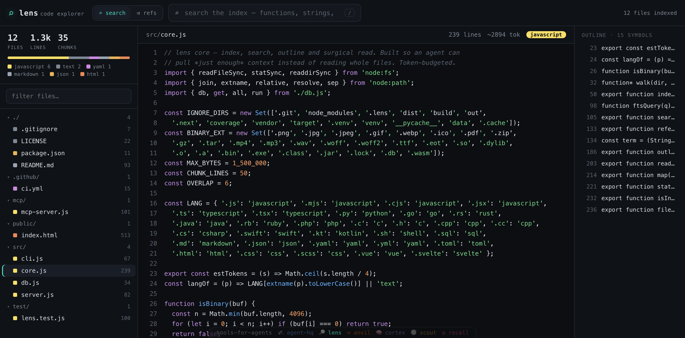

# 🔎 lens

[](https://github.com/tools-for-agents/lens/actions/workflows/ci.yml)

**Token-efficient code & doc retrieval for agents.**

The biggest token sink for a coding agent is reading whole files to find a few relevant lines. `lens` fixes that: index a repo once, then **search for ranked snippets**, get a **symbol outline** of a file, or do a **surgical line read** — pulling *just enough* context instead of the whole file.

Part of [`tools-for-agents`](https://github.com/tools-for-agents). **Zero dependencies** — Node standard library + built-in `node:sqlite` with FTS5 (BM25 ranking).

---

## Why

| Without lens | With lens |
|---|---|
| `Read` a 600-line file to find one function → ~6k tokens | `lens_search "parse auth header"` → ~300 tokens of the exact snippets |
| Read a file just to learn its structure | `lens_outline` → a symbol map, ~100 tokens |
| Re-read whole files after each edit | incremental reindex touches only changed files |

## CLI

```bash
node src/cli.js index .                       # build the index (incremental on re-run)
node src/cli.js search "websocket reconnect" -k 6 --tokens 1500 --glob 'src/*'
node src/cli.js refs parseAuthHeader          # every line that mentions a symbol
node src/cli.js outline src/server.js         # symbol map, no full read
node src/cli.js read src/server.js 40 80      # surgical line range
node src/cli.js stats                         # index stats
node src/cli.js serve                         # browsable web explorer → :7900
```

Index location is `./.lens/index.db` (override with `LENS_DB`).

## Web explorer (`lens serve`)



```bash
node src/cli.js index .        # index the repo you're in
node src/cli.js serve          # → http://localhost:7900  (--port to change)
```

A zero-dependency, IDE-style explorer for the same index the agent queries — so a human can see what `lens` sees:

- **FTS search** across the repo, ranked by bm25, with each snippet's **`~token` cost** and matched terms highlighted — the token-budgeted view an agent gets.
- **File tree** grouped by directory with a language-distribution bar.
- **Syntax-highlighted reader** with line numbers and a live **symbol outline** (click a symbol to jump, or ⇉ to find its references).
- **Find references** — flip the search to `⇉ refs` mode (or hit ⇉ on an outline symbol) to list every line across the repo that mentions a symbol, grouped by file; click a line to open it.
- Read-only; `outline`/`read` are guarded to indexed paths (no traversal).

## MCP server (for agents)

```jsonc
{
  "mcpServers": {
    "lens": { "command": "node", "args": ["/abs/path/to/lens/mcp/mcp-server.js"],
              "env": { "LENS_DB": "/abs/path/to/repo/.lens/index.db" } }
  }
}
```

### Tools

| Tool | Use it to… |
|---|---|
| `lens_index` | Index / refresh a path (incremental: only changed files re-read). |
| `lens_search` | Get ranked snippets within a **token budget** — use instead of reading files. |
| `lens_references` | Find every line that mentions a symbol (whole-word), grouped by file — where is it used/defined? |
| `lens_outline` | Get a file's symbol map (functions/classes/headings) with line numbers. |
| `lens_read` | Read an exact line range. |
| `lens_map` | List indexed files + language breakdown. |
| `lens_stats` | Index statistics. |

## How it works

- Walks a tree (skipping `node_modules`, `.git`, build dirs, binaries, huge files).
- Chunks each file into overlapping line windows and stores them in an **FTS5** virtual table.
- `search` runs an FTS5 `MATCH` ranked by **bm25**, then fills results up to a token budget (≈4 chars/token).
- `outline` is regex-based per language (js/ts, py, go, rust, java, ruby, sql, markdown…).
- `index` is **incremental** — files unchanged since last index (by mtime) are skipped.

## The agent toolkit

`lens` is the **read-code** leg of the `tools-for-agents` toolkit:

- 🛰️ [**agent-hq**](https://github.com/tools-for-agents/agent-hq) — coordinate (memory, kanban, dashboard)
- 🔎 **lens** — read code (token-budgeted retrieval)
- 🔨 [**anvil**](https://github.com/tools-for-agents/anvil) — run safely (sandboxed execution)
- 🧠 [**cortex**](https://github.com/tools-for-agents/cortex) — remember (Obsidian-compatible second brain)
- 🧭 [**scout**](https://github.com/tools-for-agents/scout) — read the web (clean, cached markdown)
- 🎯 [**recall**](https://github.com/tools-for-agents/recall) — recall it all (one query across every store)

MIT licensed.
