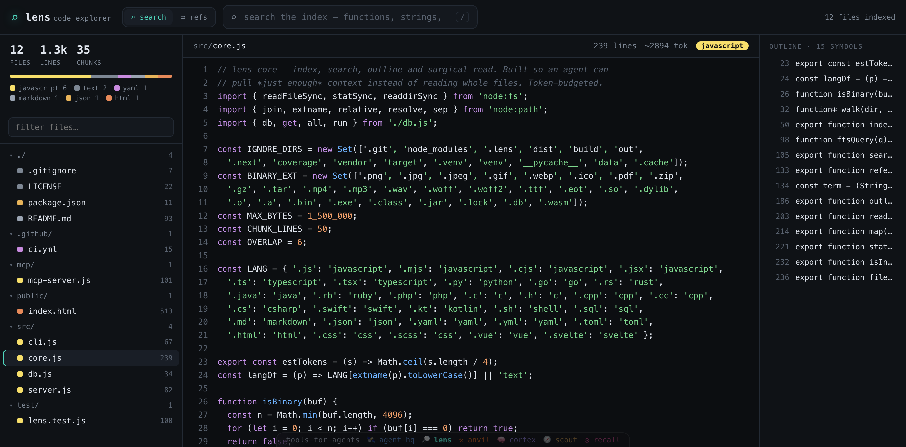

# 🔎 lens

[](https://github.com/tools-for-agents/lens/actions/workflows/ci.yml)

**Token-efficient code & doc retrieval for agents.**

The biggest token sink for a coding agent is reading whole files to find a few relevant lines. `lens` fixes that: index a repo once, then **search for ranked snippets**, get a **symbol outline** of a file, or do a **surgical line read** — pulling *just enough* context instead of the whole file.

Part of [`tools-for-agents`](https://github.com/tools-for-agents). **Zero dependencies** — Node standard library + built-in `node:sqlite` with FTS5 (BM25 ranking).

---

## Why

| Without lens | With lens |
|---|---|
| `Read` a 600-line file to find one function → ~6k tokens | `lens_search "parse auth header"` → ~300 tokens of the exact snippets |
| Read a file just to learn its structure | `lens_outline` → a symbol map, ~100 tokens |
| Re-read whole files after each edit | incremental reindex touches only changed files |

## CLI

```bash
node src/cli.js index .                       # build the index (incremental on re-run)
node src/cli.js search "websocket reconnect" -k 6 --tokens 1500 --glob 'src/*'
node src/cli.js refs parseAuthHeader          # every line that mentions a symbol
node src/cli.js outline src/server.js         # symbol map, no full read
node src/cli.js read src/server.js 40 80      # surgical line range
node src/cli.js stats                         # index stats
node src/cli.js serve                         # browsable web explorer → :7900
```

Index location is `./.lens/index.db` (override with `LENS_DB`).

**Flags go anywhere, and a mangled command is an error — never `0 hits`.** `search -k 3 "parse auth header"` and `search "parse auth header" -k 3` are the same search. (They were not: the first searched the index for the literal string `3`, printed `— 0 hits, ~0 tokens —` and exited 0 — because the query was found as "the first argument without a dash", which is the preceding flag's *value*. With `--glob 'src/*'` in front it was worse: the glob became the query, matched the indexed `path` column, and lens answered with ranked, syntax-clean snippets from the right directory to a question nobody asked.) An unknown flag, a flag with no value, forgotten quotes (`search parse auth header`), a query that is itself a flag, or an unknown command now fail on stderr with a non-zero exit and the command that fixes them — `--` ends the flags, so `search -- "--reindex"` searches for the text. And a search that honestly finds nothing carries the size of the haystack — **the scope it searched, not the index**: `— 0 hits for "<query>", ~0 tokens — searched 20 files / 129 chunks`, and under `--glob 'mcp/*'` that becomes `searched 1 file / 4 chunks matching "mcp/*"`, the filter's own count. (Counts from one run of `search` against this repo; they move as the repo does.) This shipped the other way round for one review cycle — the whole index's totals with the glob glued on the end, so a one-file filter announced twenty files and told you none of them held a symbol that is sitting in `src/core.js`. A precise wrong answer is worse than a vague one: a number invites even less of a second look.

## Web explorer (`lens serve`)



```bash
node src/cli.js index .        # index the repo you're in
node src/cli.js serve          # → http://localhost:7900  (--port to change)
```

A zero-dependency, IDE-style explorer for the same index the agent queries — so a human can see what `lens` sees:

- **FTS search** across the repo, ranked by bm25, with each snippet's **`~token` cost** and matched terms highlighted — the token-budgeted view an agent gets.
- **The budget owns up to what it hid.** `search` packs the best chunks until the token window is full and *drops the rest* — and for a long time it reported only the survivors, so `4 hits` could mean "there are 4" or "4 of 124 fit". A budget that hides results while presenting itself as complete is worse than no budget. Now every search returns `matched` / `withheld` / `limited_by`, the header reads **`4 of 124 hits · ▬▬▬ ~2.4k / 2.4k tok`** with a meter showing how full the window is, and when the budget cost you something it says so and offers the fix: *“120 more chunks matched but didn't fit the 2.4k-token budget”* → **Widen to 4.8k**, one click, more hits. It also names the *right* ceiling — if the result cap `k` bound instead of the budget, raising the budget would change nothing, so it says so and offers to raise `k`. Same in the CLI (`--tokens` / `-k`). And when nothing was withheld it stays quiet — it never cries wolf.
- **File tree** grouped by directory with a language-distribution bar, and a per-file **token-weight bar** (scaled to the heaviest file) so the pages that are expensive to read whole stand out at a glance — hover any file for its exact `~token` cost. Reading the right lines instead of the whole file is the point of `lens`, and the tree now shows you where that matters most.
- **Scope a search to a directory** — `search` has always taken a path glob (agents use it) and the web view never offered it, so every search was the whole repo. Pick a directory and the search runs inside it (`src/*` covers the whole subtree), the header says where it looked, and a scope that matches nothing finds *nothing* rather than quietly searching everything. It composes with the treemap: that map tells you **which directory holds the repo's mass — click it and search inside it**. And because results are token-budgeted, narrowing the scope often returns *more* snippets: the budget stops being eaten by the heaviest file in the repo.
- **The index knows when it's lying** — lens serves an index of a tree that keeps moving underneath it. Now it checks: if files changed, appeared or were deleted since you indexed, the rail says so (*“1 changed · 1 new · 1 deleted — search and the tree are answering from the old tree”*) and offers **↻ re-index**, which rebuilds without leaving the browser. Re-indexing is a `POST` (a `GET` must never make the server walk your disk).
- **The treemap** (`◱ map`) — where the repo's tokens actually *are*. Every file is a rectangle whose **area is its token cost**, grouped by directory and coloured by language, so the mass of the repo is a shape you can see: in `lens` itself, one file is **55% of the entire index**. Those are the files an agent must never read whole — which is the entire argument for `lens`, finally visible. Hover for the exact cost, click to open it. (The layout compensates each directory's header/padding, so a small file in a small folder is drawn at the same tokens-per-pixel as a big one — a treemap that lies about area isn't worth drawing.)
- **Recent files** — the files you've opened surface as clickable chips above the tree (remembered in the browser only, most-recent first); jump back to one in a click, or **clear ✕** to forget them.
- **Syntax-highlighted reader** with line numbers and a live **symbol outline** that **tracks your scroll** — the symbol you're currently reading stays highlighted, and clicking one jumps to it (or ⇉ to find its references). **Filter the outline by kind** — chips (`fn` · `class` · `type` · `const` · …, each with a count) narrow a big file's symbol list to just the functions, or just the classes, in one click.
- **Jump to symbol** — hit `⌘⇧O` (or the **⤳ jump** button on the outline) for a quick-nav palette over the open file: type to fuzzy-filter its symbols (matches highlighted), `↑`/`↓` to move, `Enter` to fly to one, `Esc` to dismiss — the same jump-to-symbol muscle memory as your editor, in the browser.
- **Find references** — flip the search to `⇉ refs` mode (or hit ⇉ on an outline symbol) to list every line across the repo that mentions a symbol, grouped by file; click a line to open it.
- **Copy path · copy permalink** — the reader header carries **⧉ path** (the file path, ready to paste into a prompt or a shell) and **⧉ link** (a permalink to exactly what you're reading). Click a line number to aim the permalink at that line: the URL bar becomes `…/#src/core.js:45`, and opening that link anywhere — another browser, another agent, a `recall` briefing — lands on that file at that line.
- **Send a passage to cortex** — hit **🧠 → cortex** in the reader and the code you're looking at becomes a note in your [second brain](https://github.com/tools-for-agents/cortex): the lines you selected, or — if you selected nothing — the symbol you're currently reading. It lands as a fenced code block carrying lens's own `#path:line` permalink as its source, so the note can always walk back to the code. lens never writes: your browser POSTs to cortex's own `/api/capture` (point it elsewhere with `LENS_CORTEX_URL`).
- **Light or dark** — a ◐ toggle (remembered per browser; follows your OS preference by default), with a syntax palette tuned for each.
- **Keyboard-accessible** — every control has a visible focus ring, the file tree and symbol outline are operable with Tab + Enter (not just the mouse), and icon controls carry aria-labels.
- Read-only; `outline`/`read` are guarded to indexed paths (no traversal).

## MCP server (for agents)

```jsonc
{
  "mcpServers": {
    "lens": { "command": "node", "args": ["/abs/path/to/lens/mcp/mcp-server.js"],
              "env": { "LENS_DB": "/abs/path/to/repo/.lens/index.db" } }
  }
}
```

### Tools

| Tool | Use it to… |
|---|---|
| `lens_index` | Index / refresh a path (incremental: only changed files re-read). |
| `lens_search` | Get ranked snippets within a **token budget** — use instead of reading files. |
| `lens_references` | Find every line that mentions a symbol (whole-word), grouped by file — where is it used/defined? |
| `lens_outline` | Get a file's symbol map (functions/classes/headings) with line numbers. |
| `lens_read` | Read an exact line range. |
| `lens_map` | List indexed files + language breakdown. |
| `lens_freshness` | Is the index stale? What changed / was added / removed since you indexed. |
| `lens_stats` | Index statistics. |

## How it works

- Walks a tree (skipping `node_modules`, `.git`, build dirs, binaries, huge files).
- Chunks each file into overlapping line windows and stores them in an **FTS5** virtual table.
- `search` runs an FTS5 `MATCH` ranked by **bm25**, then fills results up to a token budget (≈4 chars/token).
- `outline` is regex-based per language (js/ts, py, go, rust, java, ruby, sql, markdown…).
- `index` is **incremental** — files unchanged since last index (by mtime) are skipped.

## The agent toolkit

<!-- toolkit:start — generated from tools.json by tools-for-agents.github.io/build/toolkit-block.mjs; edit that, not this -->

`lens` is the **read code** leg of **[tools-for-agents](https://tools-for-agents.github.io)** — an operating system for agents.
Nine zero-dependency, MCP-native tools that form one loop, with a self at its centre:

| | | |
|---|---|---|
| 🛰️ | [agent-hq](https://github.com/tools-for-agents/agent-hq) | coordinate — The company's work, made visible. |
| 🔎 | **lens** | **read code** — Read code without reading files. |
| ⚒ | [anvil](https://github.com/tools-for-agents/anvil) | run safely — Run it before you claim it works. |
| 🔐 | [keep](https://github.com/tools-for-agents/keep) | hold secrets — Use a secret without holding it. |
| 🧠 | [cortex](https://github.com/tools-for-agents/cortex) | remember — A second brain that outlives the context window. |
| 🧭 | [scout](https://github.com/tools-for-agents/scout) | read the web — The web, ~90% lighter. |
| 🔻 | [prism](https://github.com/tools-for-agents/prism) | read data — Read data without reading the blob. |
| ◎ | [recall](https://github.com/tools-for-agents/recall) | recall it all — One query. Every store you have. |
| 👁 | [iris](https://github.com/tools-for-agents/iris) | see — Look at what you built. |
| 👻 | [ghost](https://github.com/tools-for-agents/ghost) | *the self at the centre* — A self that persists across sessions. Not a tool: it is what the agent **is** while it calls these. |

**Reading this as an agent?** [`/llms.txt`](https://tools-for-agents.github.io/llms.txt) is the map, and
[`/tools.json`](https://tools-for-agents.github.io/tools.json) hands you all **79 MCP tools** — every name, every
description, every install command — in **one fetch**, without cloning anything.

<!-- toolkit:end -->

MIT licensed.
